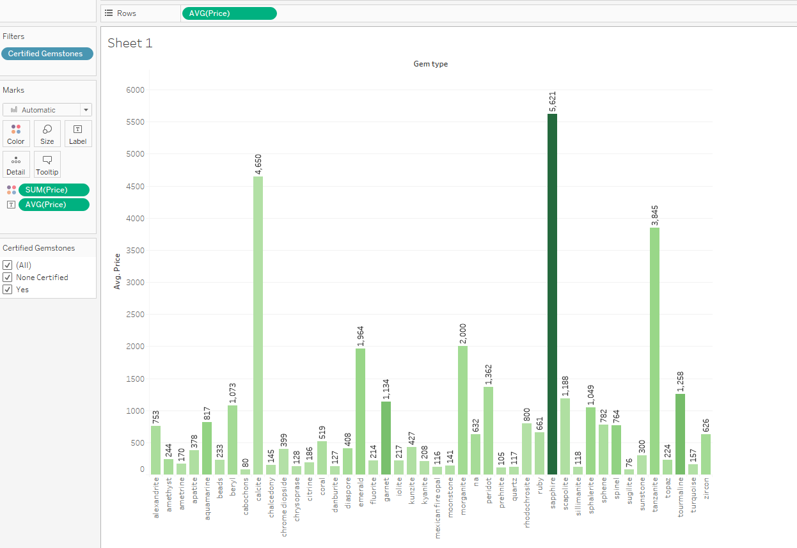
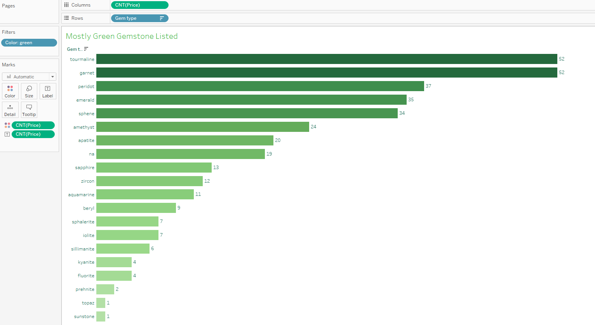
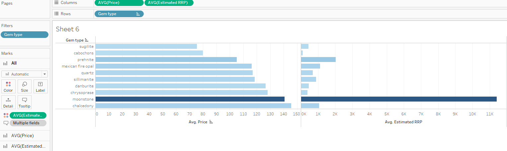
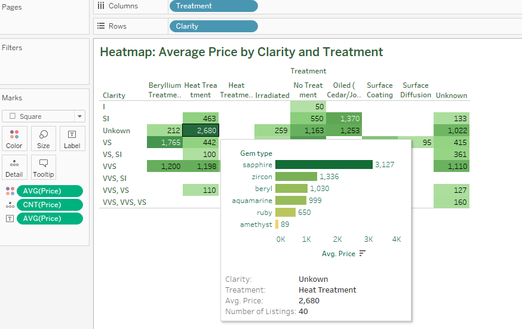
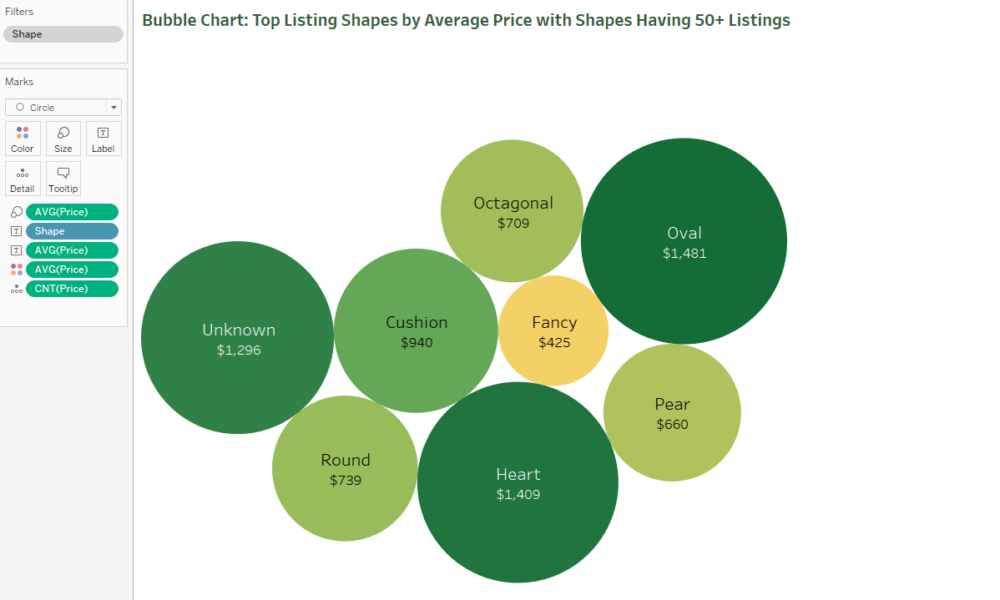
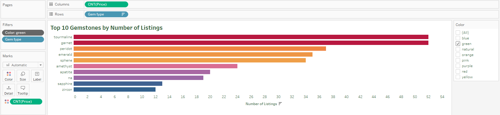
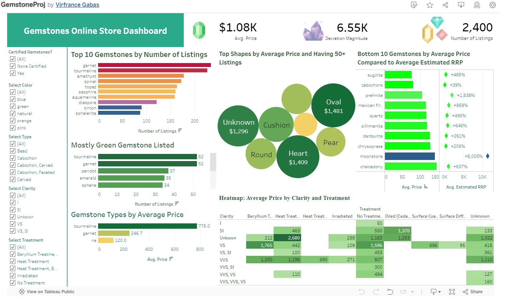

<h1 style="text-align: center;">Gemstone Online Analysis
</h1>  

 
Photo by Jeff Scovil, courtesy of Bridges Tsavorite
 
 

## Introduction
Who isn't mesmerized by the beauty of gemstones? Personally, I favor green ones like emerald. In this project, I'll employ both Python and Tableau. Initially, I'll scrape data from a specific store on an online gemstone site. Then I will perform data cleaning in Python and use Tableau to answer questions I am interested in.
 
 

## Data Collection

Using the Selenium and BeautifulSoup (bs4) packages, I was able to scrape data from a website where gemstones are listed in a grid of pictures. Clicking on a gemstone opens its source link, where you can view the price, title, and additional information about the gemstone. The picture below illustrates how the gemstones are listed on the site.
 

 
Gemstone List in the Site
 
 
If you wanted to check my code, you may see it [here.](https://github.com/ushertpain/gem_price_data_analysis_proj/blob/master/data_scraper.py)

Additionally, ChatGPT helped me find a solution using BeautifulSoup to locate "< dt >" tags and retrieve their corresponding "< dd >" tags. To prevent the CSV from being overwritten, I commented out the section where I input the CSV header.

Throughout the scraping process, I encountered various troubleshooting challenges, such as error handling using try and except functions. Additionally, I faced unexplained errors, such as sudden errors or human errors like accidentally scrolling, which led to an IndexError: list index out of range. To save time, I copied the URL of the page where the error occurred. I will handle this duplicate data during the data cleaning process in Python. 

Here is a preview of how the code scrapes the data:
 

 
Scraping in Action
 
 
As you can see in the Spyder IDE, you can view the console where I display all the objects I scraped. In the picture above, you can see that 720 data points have already been scraped. You can also inspect the raw data collected by my scraper: [Click here!](https://github.com/ushertpain/gem_price_data_analysis_proj/blob/master/Gemstone_raw_data.csv)

## Data Cleaning
In this process, I utilized Jupyter Notebook. Firstly, I imported relevant libraries such as pandas. Secondly, I removed duplicates using the following line of code: 'df = df.drop_duplicates()', which reduced the size of the raw dataset from (2837, 10) to (2590, 10), resulting in the removal of 247 instances. Thirdly, I removed instances with no value in the 'Price' column using the following line of code: 'df = df[df['Price'].notna()]', which led to the deletion of 190 instances. Upon inspecting the data types of my pandas dataframe, I discovered that the 'Price' and 'Estimated RRP' columns were in object data type format. See the picture below.
 

 
Data Types
 
 
To address this issue, I investigated the 'Price' column and discovered that the values contained commas, which prevented them from being recognized as numeric. Therefore, I used the following line of code for both the 'Price' and 'Estimated RRP' columns:: 'df['Price'] = df['Price'].str.replace(',', '') df['Estimated RRP'] = df['Estimated RRP'].str.replace(',', '')'. And to convert them into the desired data type format, I used this code: df['Price'] = 'df['Price'].astype(float).round(2) df['Estimated RRP'] = df['Estimated RRP'].astype(float).round(2)'. The fourth task I completed was adding three new columns to extract individual measurements from the 'Dimension (mm)' column, namely: 'Length (mm)', 'Width (mm)', and 'Height (mm)'. And to ensure consistency, I will also format the three new columns into a float data type. Here is a screenshot of my code to extract each measurement and assign it to their respective columns. 
 

 
Getting the L, W, and H
 
 
The fifth step involved creating two more new columns, namely 'Color' and 'Gem_type', using 'df.insert()'. To extract the color from the 'Title' column, I created a function. This function parses the values from the 'Title' column and returns the particular color it finds. 
 

 
Function Color Extraction
 
 
As for the 'Gem_type' column, I will create a list containing all the types of gems present in the online gemstone store. Then, I will create a function to extract the gem type information by parsing the values of the 'Title' column.
 

 
List and Function to Extract Gem Type
 
 
Using this code 'df['Color'] = df['Title'].apply(get_color)' to extract each color value from the column 'Title', and to obtain the gem type, I will use this code 'df['Gem_type'] = df['Title'].apply(get_gem_type)'. As shown in the image below, the two new columns now have their corresponding values.
 

 
Color and Gem Type
 
 
The 6th step involves using pandas interpolate to fill up the missing values in the 'Estimated RRP' column. First, I'll create a copy of my DataFrame containing only the 'Price' and 'Estimated RRP' columns, allowing me to utilize the 'interpolate()' pandas function. Afterward, I will transfer the values from the copy to my main DataFrame using this code: 'df[['Price', 'Estimated RRP']] = dfprice_rrp'. Now, all the missing values in the 'Estimated RRP' column have been populated.
 

 
Interpolate Column Estimated RRP
 
 
The final step is to ensure that my dataset has no null values. The best way to do this with Python is by using the code 'df.isnull().sum()'. The output of this code displays all column names along with the corresponding count of null values. Upon thorough investigation, I discovered that the 'Certified Gemstones', 'Treatment', 'Shape', 'Weight (cts)', and 'Type' columns contain null values.

To address this issue, I will proceed to fill all null values. For the 'Certified Gemstones' column, I used the code 'df['Certified Gemstones'] = df['Certified Gemstones'].fillna('None Certified')', which replaces the null values in that column with the string 'None Certified'. Similarly, for the 'Treatment' column, I utilized the code 'df['Treatment'] = df['Treatment'].fillna('Unknown')' to change all null values to 'Unknown'. In the 'Shape' column, I employed the code 'df['Shape'] = df['Shape'].fillna('Unknown')' to replace null values with the string 'Unknown'.

Regarding the 'Weight (cts)' column, which has only one null value, I utilized the interpolate() function in pandas to fill the missing value. Finally, for the 'Type' column, I applied the same approach, using the code 'df['Type'] = df['Type'].fillna('Unknown')' to convert null values to the string 'Unknown'.

## Data Analysis
I listed out initial questions I was interested in:
- Q1: Averagely, what is the most pricey kind of gemstone?
- Q2: How many green emeralds are available in that store, and which other gemstones are mostly green in color?
- Q3: Which gemstones are listed in the bottom 10 in terms of price but have a high Estimated RRP?
- Q4: What is the gemstone with the highest average price considering treatment and clarity?
- Q5: Which gemstone shape has the highest average price among those with listings exceeding 50 at that time?
- Q6: What are the top 10 types of gemstones along with their respective colors?

### Averagely, what is the most pricey kind of gemstone?
To address Q1, I will use Tableau and connect the "cleaned_gem_price_data.csv" dataset. In Sheet 1, I will drag the 'Gem type' measure to the Column field. Then, in the Rows field, I will drag the 'Price' measure and calculate its average. Next, I will press ctrl and drag 'AVG(Price)' to the Marks Card Label to display the average price of each gemstone type. For color differentiation, in the Measure Values, I will drag the Price to the Marks Card Color and change the color to green.

Upon observation, it becomes evident that the sapphire gemstone is the most expensive in the store during that particular time, with an average price of $5,621 and a total price listing of almost $900K. The calcite gemstone ranks 2nd, but upon investigation, it is revealed that there is only one listing of calcite at the moment, hence its total price listing remains the same. Tanzanite ranks 3rd in terms of average price.
 

 
Average Price by Gemstone Type
 
 
### How many green emeralds are available in that store, and which other gemstones are mostly green in color?
To address Q2, I will create a new sheet named "GreenGem" in Tableau. I will then place the Measure Name 'Gem type' into Rows and 'Price' into Columns, setting the measure to count to display the number of listings. Next, I will press Ctrl and drag 'CNT(Price)' from the Column field to the Marks Card Color, setting the color to green. To display the count of listings, I will repeat the previous step with 'CNT(Price)' and drag it to Label in the Marks Card. Upon observation, it is evident that there are a total of 35 listings for green emeralds on the gemstone online store. Notably, emerald ranks fourth in terms of frequency, while tourmaline, garnet, peridot, and sphene are among the top five most frequently listed green gemstones.
 

 
Top Green Gemstones Listings
 
 
### Which gemstones are listed in the bottom 10 in terms of price but have a high Estimated RRP?
To answer Q3, I will create a new sheet where I will place Measure Values 'Price' and 'Estimated RRP' into Columns and set the measure to average. Then, I will place Measure Name 'Gem type' in Rows, which will automatically generate a bar chart showing the gemstone types and their corresponding average prices on the left. On the right side, the x-axis will display the average estimated RRP (Recommended Retail Price).

To visualize the percentage difference between 'Price' and 'Estimated RRP', I will create a new calculated field by right-clicking in the Tables field, selecting "create calculated field," and naming it "Percentage Price Increase." The formula for this calculated field will be '((AVG([Estimated RRP]) - AVG([Price]) )/ AVG([Price])) * 100'. Once created, I will drag this calculated field into the Tooltip inside the Marks Card. I will then double-click the Tooltip and append '%' to the end of '<AGG(Percentage Price Increase)>' to display the percentage when hovering over the bars.

Sorting the chart by Average Price will reveal high average Estimated RRP values corresponding to certain gemstone types. To filter the gemstones based on their average price, I will click the down arrow next to Gem type in the Rows field, select Filter, navigate to Top, then choose Bottom, 10, Price, average, and click OK.

Observing the chart, it becomes apparent that moonstone has the highest estimated recommended retail price. By hovering over its bar, a staggering relative change of 8005% is displayed, with an average price of $140.68 and an estimated RRP of $11,401.
 

 
Comparing Bottom 10 Gemstones by Average Price to Estimated Retail Values
 
 
### What is the gemstone with the highest average price considering treatment and clarity?
In gemology, clarity grades are often represented by acronyms to indicate the level of imperfections or inclusions present in a gemstone. Here are some common clarity acronyms used at that time and their meanings:
- VVS (Very, Very Small inclusions)
- VVS, VS (Very, Very Small inclusions, Very Small inclusions)
- VS, SI (Very Small inclusions, Small Inclusions)
- VVS, VVS, VS (Very, Very Small inclusions, Very, Very Small inclusions, Very Small inclusions)
- VS (Very Small inclusions)
- SI (Small Inclusions)
- VVS, SI ( Very, Very Small inclusions, Small Inclusions)
- I (Included)

To address Q4, I will create a new sheet in Tableau. Firstly, I'll set up a heatmap by adding 'Treatment' to the Columns field and 'Clarity' to the Rows field. By changing the Marks Card to Square and adding the Measure Values 'Price' (set to average) to the Marks Color, the heatmap will display darker colors for higher average prices.

Next, I'll add the average price numbers inside each box to represent the average price depending on the gemstone's clarity and treatment. This will be done by dragging 'AVG(Price)' to Text in the Marks Card.

Observing the heatmap, it's notable that the combination of unknown clarity and heat treatment has the highest overall average price, totaling $2,680 with 40 listings at that time. To identify which gemstone has the highest average price at that time, I'll configure the Tooltip inside the Marks Card. I'll insert the first sheet I created, which contains all gemstone types and their average prices, and click OK.

To visualize the gemstone with the highest average price at that moment, I'll return to the first sheet and sort the prices in descending order. Hovering over the darkest color on the heatmap with the value of 2680, it's revealed that the sapphire gemstone boasts the highest average price at $3,127.
 

 
Title: Heatmap: Average Price by Treatment and Clarity, Tooltip: Hover for Top Gemstone Rankinge
 
 
### Which gemstone shape has the highest average price among those with listings exceeding 50 at that time?
To address Q5, I will use a Bubble Chart. Firstly, I'll create a new sheet and add 'Shape' to the column field, then I'll add 'Price' (set to average) to the Rows field. In the upper right corner, I'll click on Show Me and select the bubble chart option.

To add color where darker shades represent higher average prices, I'll press ctrl and click on 'AVG(Price)' inside the Marks Card, then drag it to the Color.

Since I'm interested in shapes with over 50 listings only, I'll filter the Shape by clicking the small down arrow next to 'Shape' inside the Marks Card, then select Filter. Inside the Filter box, I'll click on Condition, select 'By field', choose Price, then Count, select 'greater than', input 50, and click OK.

By examining the chart, it becomes evident that Oval, Heart, and Unknown shapes have the highest average prices. Hovering over each circle reveals that Oval shape ranks first with an average price of $1,481, followed by Heart shape with $1,409, and Unknown shape with $1,296 average price at that time. To ensure viewers can clearly see the average prices, I'll add 'AVG(Price)' to the Text inside the Marks Card, and 'CNT(Price)' to Details, so when hovering over each bubble, they can see the total number of listings.
 

 
Bubble Chart: Shapes with Over 50 Listings by Average Price
 
 
### What are the top 10 types of gemstones along with their respective colors?
Finally, to address Q6, I will add a new sheet. Inside the Columns field, I will drag 'Price' set to count, and 'Gem type' in the Rows field. To add color, I will press Ctrl and drag 'CNT(Price)' to the Color inside the Marks card. Just to see the top 10 only, I will click the down arrow next to 'Gem type' in the Rows field, then Filter. Inside the filter box, I will click Top, then choose: By field, Top, 10, Price, then Count, and click OK. Click the icon near the x-axis label and sort it in descending order. Now, drag the 'Color' into Filters, Choose all colors first then click OK. Looking at the chart, we see that overall the top gemstone is garnet with 233 listings. To ensure it displays the correct listings, I will right-click the 'Color' inside the Filters Card, then click 'Add to Context'. After that, as I filter one color at a time, I noticed some discrepancies in the output of the charts. When I clear the top 10 filter in the 'Gemstone type', the results for the top listings differ from when I filter it to show only the top 10. Check the image below.
 

 
Top 10 Filters Discrepancies
 
 
To address this issue, I will right-click the 'Colors' inside the Filters Card, then click 'Add to Context', which resolves the problem. Here are the results for the top gemstone based on the number of listings:
- Blue: Topaz
- Green: Tourmaline
- Natural: Diaspore
- Orange: Garnet
- Pink: Tourmaline
- Purple: Amethyst
- Red: Coral
- Yellow: Beryl
  
It's also observable that garnet and tourmaline are almost always present in different color categories, indicating that these gemstones likely have the highest supply at that moment.
 

 
Top 10 Green Gemstones Listed
 
 
### Conclusion
In this data analysis process, I employed various techniques and tools to gather, clean, and analyze data from an online gemstone store. Here's a summary of the key steps and findings:

1. Data Scraping: Utilized Selenium and BeautifulSoup to scrape data from a website listing gemstones. Extracted details such as price, title, and additional information by clicking on individual gemstones.

2. Data Cleaning: Faced challenges such as duplicate data and format inconsistencies. Used pandas in Jupyter Notebook to clean the dataset, including removing duplicates, handling missing values, and converting data types.

3. Data Analysis:
- Identified sapphire as the most expensive gemstone based on average price, followed by calcite and tanzanite.
- Discovered a total of 35 listings for green emeralds, with emerald being the fourth most frequent green gemstone.
- Observed moonstone as having the highest estimated recommended retail price, along with a significant relative change percentage compared to its average price.
- Analyzed a heatmap to identify the gemstone with the highest average price, which was found to be sapphire.
- Created a bubble chart to identify and visualize gemstone shapes with over 50 listings along with their corresponding average prices.
- Identified garnet as the top gemstone in terms of the number of listings, with further insights into the top listings for different gemstone colors.

4. Troubleshooting and Refinement: Encountered various challenges during the data scraping and cleaning processes, including error handling and unexpected errors. Employed strategies such as try-except blocks and data context adjustments to address these issues effectively.

Overall, through meticulous data gathering, cleaning, and analysis techniques, valuable insights were obtained regarding gemstone listings, prices, and characteristics, contributing to a deeper understanding of the online gemstone market.

Thank you for reading. Have a pleasant day!
 
 
 
 
 
 

Side note: I am also interested in exploring how the price, gemstone, and the listing behavior changes when filtered by Color, Type, etc. Therefore, I have created an interactive dashboard featuring average price, price standard deviation, and number of listings as my key performance indicators (KPIs). You may check out my dashboard in Tableau here: [Tableau link](https://public.tableau.com/app/profile/virfrance.gabas/viz/GemstoneProj/GemstoneDashBoard)
 

 
Preview of my Dashboard
 
 
Dashboard Reference: [Link](https://youtu.be/KlAKAarfLRQ?t=1360)

