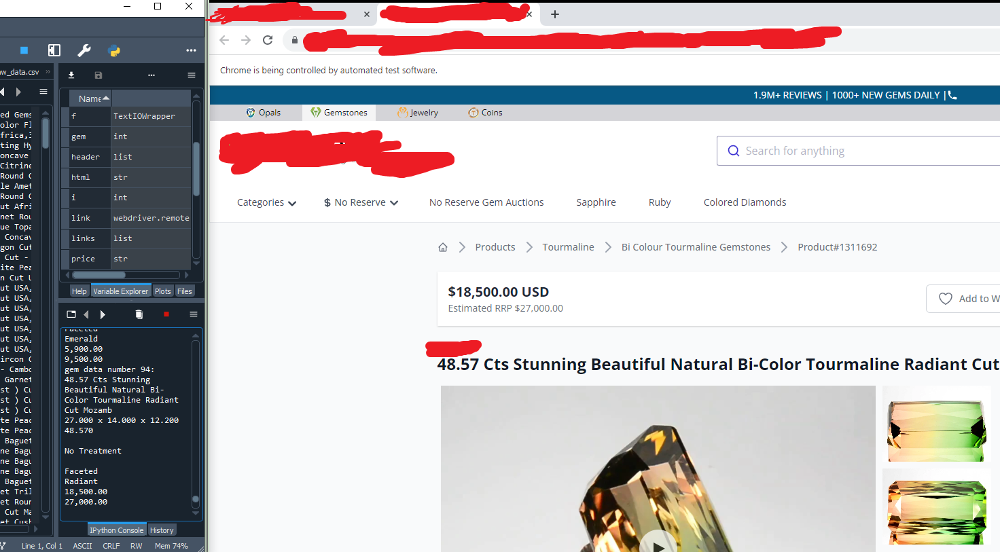
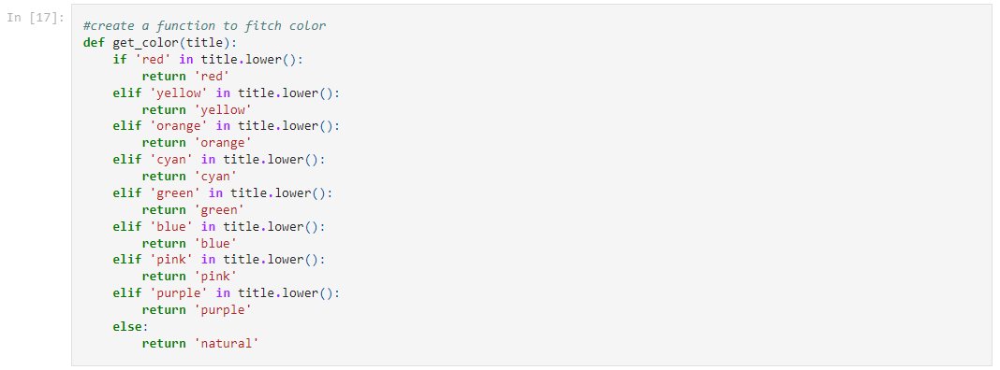
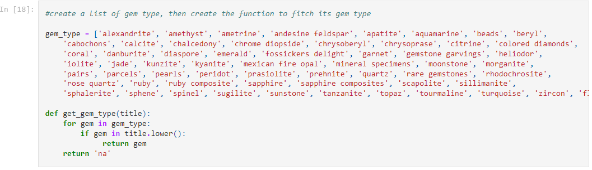
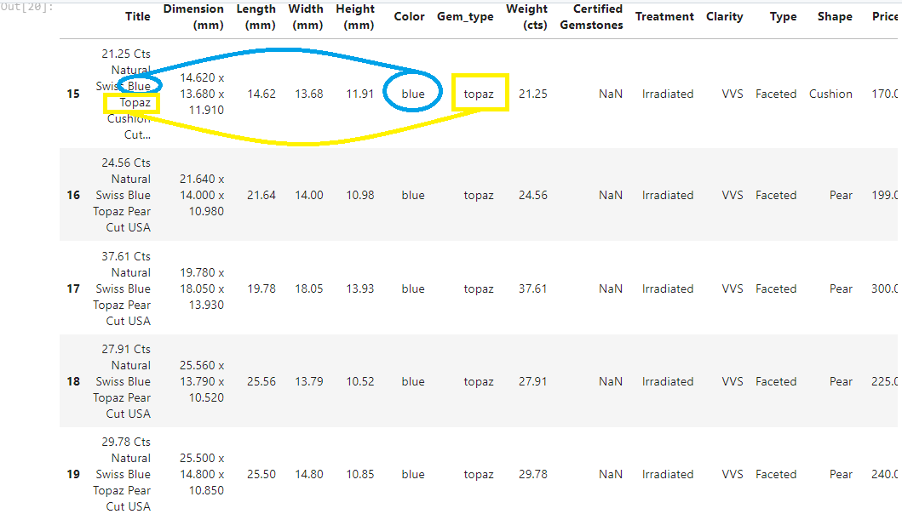

<h1 style="text-align: center;">Gemstone Online Analysis
</h1>  

 
Photo by Jeff Scovil, courtesy of Bridges Tsavorite
 
 

### Introduction
Who isn't mesmerized by the beauty of gemstones? Personally, I prefer green ones like emerald. In this project, I will utilize both Python and Tableau. I will scrape data from a particular site, then clean and analyze it using Python, and finally, create a dashboard using Tableau.
 
 

### Data Collection

Using the Selenium and BeautifulSoup (bs4) packages, I was able to scrape data from a website where gemstones are listed in a grid of pictures. Clicking on a gemstone opens its source link, where you can view the price, title, and additional information about the gemstone. The picture below illustrates how the gemstones are listed on the site.
 

 
Gemstone List in the Site
 
 
If you wanted to check my code, you may see it [here.](https://github.com/ushertpain/gem_price_data_analysis_proj/blob/master/data_scraper.py)

Additionally, ChatGPT helped me find a solution using BeautifulSoup to locate "< dt >" tags and retrieve their corresponding "< dd >" tags. To prevent the CSV from being overwritten, I commented out the section where I input the CSV header.

Throughout the scraping process, I encountered various troubleshooting challenges, such as error handling using try and except functions. Additionally, I faced unexplained errors, such as sudden errors or human errors like accidentally scrolling, which led to an IndexError: list index out of range. To save time, I copied the URL of the page where the error occurred. I will handle this duplicate data during the data cleaning process in Python. 

Here is a preview of how the code scrapes the data:
 

 
Scraping in Action
 
 
As you can see in the Spyder IDE, you can view the console where I display all the objects I scraped. In the picture above, you can see that 720 data points have already been scraped. You can also inspect the raw data collected by my scraper: [Click here!](https://github.com/ushertpain/gem_price_data_analysis_proj/blob/master/Gemstone_raw_data.csv)

### Data Cleaning
In this process, I utilized Jupyter Notebook. Firstly, I imported relevant libraries such as pandas. Secondly, I removed duplicates using the following line of code: 'df = df.drop_duplicates()', which reduced the size of the raw dataset from (2837, 10) to (2590, 10), resulting in the removal of 247 instances. Thirdly, I removed instances with no value in the 'Price' column using the following line of code: 'df = df[df['Price'].notna()]', which led to the deletion of 190 instances. Upon inspecting the data types of my pandas dataframe, I discovered that the 'Price' and 'Estimated RRP' columns were in object data type format. See the picture below.
 

 
Data Types
 
 
To address this issue, I investigated the 'Price' column and discovered that the values contained commas, which prevented them from being recognized as numeric. Therefore, I used the following line of code for both the 'Price' and 'Estimated RRP' columns:: 'df['Price'] = df['Price'].str.replace(',', '') df['Estimated RRP'] = df['Estimated RRP'].str.replace(',', '')'. And to convert them into the desired data type format, I used this code: df['Price'] = 'df['Price'].astype(float).round(2) df['Estimated RRP'] = df['Estimated RRP'].astype(float).round(2)'. The fourth task I completed was adding three new columns to extract individual measurements from the 'Dimension (mm)' column, namely: 'Length (mm)', 'Width (mm)', and 'Height (mm)'. And to ensure consistency, I will also format the three new columns into a float data type. Here is a screenshot of my code to extract each measurement and assign it to their respective columns. 
 

 
Getting the L, W, and H
 
 
The fifth step involved creating two more new columns, namely 'Color' and 'Gem_type', using 'df.insert()'. To extract the color from the 'Title' column, I created a function. This function parses the values from the 'Title' column and returns the particular color it finds. 
 

 
Function Color Extraction
 
 
As for the 'Gem_type' column, I will create a list containing all the types of gems present in the online gemstone store. Then, I will create a function to extract the gem type information by parsing the values of the 'Title' column.
 

 
List and Function to Extract Gem Type
 
 
Using this code 'df['Color'] = df['Title'].apply(get_color)' to extract each color value from the column 'Title', and to obtain the gem type, I will use this code 'df['Gem_type'] = df['Title'].apply(get_gem_type)'. As shown in the image below, the two new columns now have their corresponding values.
 

 
Color and Gem Type
 
 
Finally, I will use pandas interpolate to fill up the missing values in the 'Estimated RRP' column. First, I'll create a copy of my DataFrame with only the 'Price' and 'Estimated RRP' columns, so I can use the 'interpolate()' pandas function. After that, I will transfer the values from the copy to my main DataFrame using this code 'df[['Price', 'Estimated RRP']] = dfprice_rrp'. Now, all the missing values in the 'Estimated RRP' column have been populated.
 

 
Interpolate Column Estimated RRP
 
 
