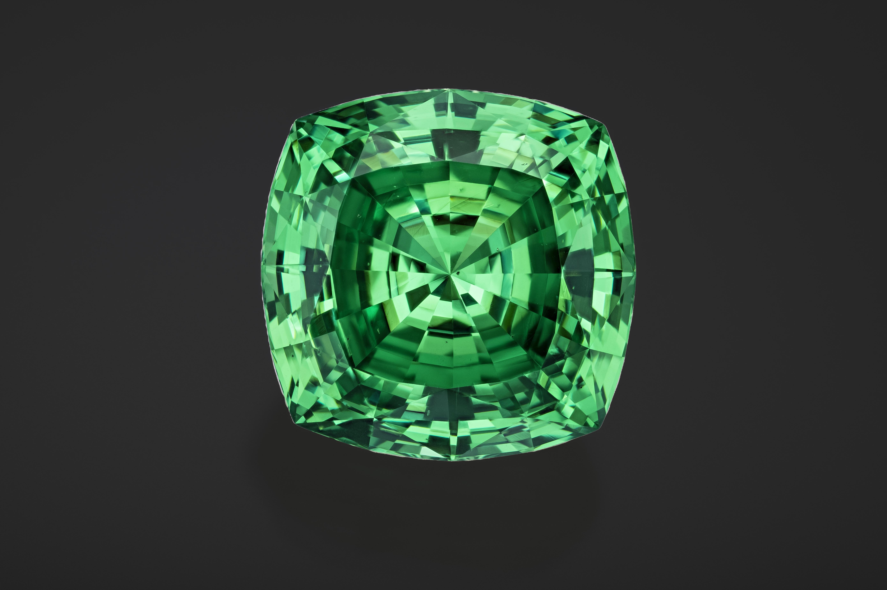

<h1 style="text-align: center;">Gemstone Online Analysis
</h1>  

 
Photo by Jeff Scovil, courtesy of Bridges Tsavorite
 
 

## Introduction
Who isn't mesmerized by the beauty of gemstones? Personally, I favor green ones like emerald. In this project, I'll employ both Python and Tableau. Initially, I'll scrape data from a specific store on an online gemstone site. Then I will perform data cleaning in Python and use Tableau to answer questions I am interested in.
 
 

## Data Collection

Using the Selenium and BeautifulSoup (bs4) packages, I was able to scrape data from a website where gemstones are listed in a grid of pictures. Clicking on a gemstone opens its source link, where you can view the price, title, and additional information about the gemstone. The picture below illustrates how the gemstones are listed on the site.
 

 
Gemstone List in the Site
 
 
If you wanted to check my code, you may see it [here.](https://github.com/ushertpain/gem_price_data_analysis_proj/blob/master/data_scraper.py)

Additionally, ChatGPT helped me find a solution using BeautifulSoup to locate "< dt >" tags and retrieve their corresponding "< dd >" tags. To prevent the CSV from being overwritten, I commented out the section where I input the CSV header.

Throughout the scraping process, I encountered various troubleshooting challenges, such as error handling using try and except functions. Additionally, I faced unexplained errors, such as sudden errors or human errors like accidentally scrolling, which led to an IndexError: list index out of range. To save time, I copied the URL of the page where the error occurred. I will handle this duplicate data during the data cleaning process in Python. 

Here is a preview of how the code scrapes the data:
 

 
Scraping in Action
 
 
As you can see in the Spyder IDE, you can view the console where I display all the objects I scraped. In the picture above, you can see that 720 data points have already been scraped. You can also inspect the raw data collected by my scraper: [Click here!](https://github.com/ushertpain/gem_price_data_analysis_proj/blob/master/Gemstone_raw_data.csv)

## Data Cleaning
In this process, I utilized Jupyter Notebook. Firstly, I imported relevant libraries such as pandas. Secondly, I removed duplicates using the following line of code: 'df = df.drop_duplicates()', which reduced the size of the raw dataset from (2837, 10) to (2590, 10), resulting in the removal of 247 instances. Thirdly, I removed instances with no value in the 'Price' column using the following line of code: 'df = df[df['Price'].notna()]', which led to the deletion of 190 instances. Upon inspecting the data types of my pandas dataframe, I discovered that the 'Price' and 'Estimated RRP' columns were in object data type format. See the picture below.
 

 
Data Types
 
 
To address this issue, I investigated the 'Price' column and discovered that the values contained commas, which prevented them from being recognized as numeric. Therefore, I used the following line of code for both the 'Price' and 'Estimated RRP' columns:: 'df['Price'] = df['Price'].str.replace(',', '') df['Estimated RRP'] = df['Estimated RRP'].str.replace(',', '')'. And to convert them into the desired data type format, I used this code: df['Price'] = 'df['Price'].astype(float).round(2) df['Estimated RRP'] = df['Estimated RRP'].astype(float).round(2)'. The fourth task I completed was adding three new columns to extract individual measurements from the 'Dimension (mm)' column, namely: 'Length (mm)', 'Width (mm)', and 'Height (mm)'. And to ensure consistency, I will also format the three new columns into a float data type. Here is a screenshot of my code to extract each measurement and assign it to their respective columns. 
 

 
Getting the L, W, and H
 
 
The fifth step involved creating two more new columns, namely 'Color' and 'Gem_type', using 'df.insert()'. To extract the color from the 'Title' column, I created a function. This function parses the values from the 'Title' column and returns the particular color it finds. 
 

 
Function Color Extraction
 
 
As for the 'Gem_type' column, I will create a list containing all the types of gems present in the online gemstone store. Then, I will create a function to extract the gem type information by parsing the values of the 'Title' column.
 

 
List and Function to Extract Gem Type
 
 
Using this code 'df['Color'] = df['Title'].apply(get_color)' to extract each color value from the column 'Title', and to obtain the gem type, I will use this code 'df['Gem_type'] = df['Title'].apply(get_gem_type)'. As shown in the image below, the two new columns now have their corresponding values.
 

 
Color and Gem Type
 
 
The 6th step involves using pandas interpolate to fill up the missing values in the 'Estimated RRP' column. First, I'll create a copy of my DataFrame containing only the 'Price' and 'Estimated RRP' columns, allowing me to utilize the 'interpolate()' pandas function. Afterward, I will transfer the values from the copy to my main DataFrame using this code: 'df[['Price', 'Estimated RRP']] = dfprice_rrp'. Now, all the missing values in the 'Estimated RRP' column have been populated..
 

 
Interpolate Column Estimated RRP
 
 
The final step is to ensure that my dataset has no null values. The best way to do this with Python is by using the code 'df.isnull().sum()'. The output of this code displays all column names along with the corresponding count of null values. Upon thorough investigation, I discovered that the 'Certified Gemstones', 'Treatment', 'Shape', 'Weight (cts)', and 'Type' columns contain null values.

To address this issue, I will proceed to fill all null values. For the 'Certified Gemstones' column, I used the code 'df['Certified Gemstones'] = df['Certified Gemstones'].fillna('None Certified')', which replaces the null values in that column with the string 'None Certified'. Similarly, for the 'Treatment' column, I utilized the code 'df['Treatment'] = df['Treatment'].fillna('Unknown')' to change all null values to 'Unknown'. In the 'Shape' column, I employed the code 'df['Shape'] = df['Shape'].fillna('Unknown')' to replace null values with the string 'Unknown'.

Regarding the 'Weight (cts)' column, which has only one null value, I utilized the interpolate() function in pandas to fill the missing value. Finally, for the 'Type' column, I applied the same approach, using the code 'df['Type'] = df['Type'].fillna('Unknown')' to convert null values to the string 'Unknown'.

## Data Analysis
I listed out initial questions I was interested in:
- Q1: Averagely, what is the most pricey kind of gemstone?
- Q2: How many green emeralds are available in that store, and which other gemstones are mostly green in color?
- Q3: Which gemstones are listed in the bottom 10 in terms of price but have a high Estimated RRP?
- Q4: What is the most expensive gemstone in terms of treatment and clarity?
- Q5: How many types and shapes are listed?
- Q6: What are the top 10 types of gemstones and their respective colors listed?

To address Q1, I will use Tableau and connect the "cleaned_gem_price_data.csv" dataset. In Sheet 1, I will drag the 'Gem type' measure to the Column field. Then, in the Rows field, I will drag the 'Price' measure and calculate its average. Next, I will press ctrl and drag 'AVG(Price)' to the Marks Card Label to display the average price of each gemstone type. For color differentiation, in the Measure Values, I will drag the Price to the Marks Card Color and change the color to green.

Upon observation, it becomes evident that the sapphire gemstone is the most expensive in the store during that particular time, with an average price of $5,621 and a total price listing of almost $900K. The calcite gemstone ranks 2nd, but upon investigation, it is revealed that there is only one listing of calcite at the moment, hence its total price listing remains the same. Tanzanite ranks 3rd in terms of average price.
 

 
Average Price by Gemstone Type
 
 
To address Q2, I will create a new sheet named "GreenGem" in Tableau. I will then place the Measure Name 'Gem type' into Rows and 'Price' into Columns, setting the measure to count to display the number of listings. Next, I will press Ctrl and drag 'CNT(Price)' from the Column field to the Marks Card Color, setting the color to green. To display the count of listings, I will repeat the previous step with 'CNT(Price)' and drag it to Label in the Marks Card. Upon observation, it is evident that there are a total of 35 listings for green emeralds on the gemstone online store. Notably, emerald ranks fourth in terms of frequency, while tourmaline, garnet, peridot, and sphene are among the top five most frequently listed green gemstones.
 

 
Average Price by Gemstone Type
 
 
