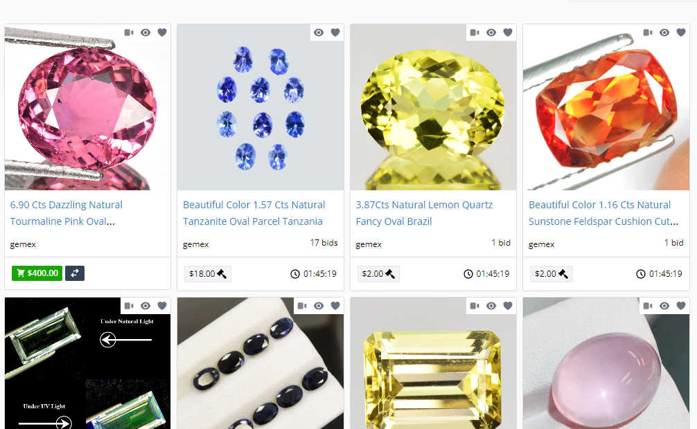

<h1 style="text-align: center;">Gemstone Online Price Analysis
</h1>  

 
Photo by Jeff Scovil, courtesy of Bridges Tsavorite
 
 

### Introduction
Who isn't mesmerized by the beauty of gemstones? Personally, I prefer green ones like emerald. In this project, I will utilize both Python and Tableau. I will scrape data from a particular site, then clean and analyze it using Python, and finally, create a dashboard using Tableau.
 
 

### Data Collection

Using the Selenium and BeautifulSoup (bs4) packages, I was able to scrape data from a website where gemstones are listed in a grid of pictures. Clicking on a gemstone opens its source link, where you can view the price, title, and additional information about the gemstone. The picture below illustrates how the gemstones are listed on the site.
 

 
Gemstone List in the Site
 
 
If you wanted to check my code, you may see it [here.](https://github.com/ushertpain/gem_price_data_analysis_proj/blob/master/data_scraper.py)

Additionally, ChatGPT helped me find a solution using BeautifulSoup to locate <dt> tags and retrieve their corresponding <dd> tags. To prevent the CSV from being overwritten, I commented out the section where I input the CSV header.

Throughout the scraping process, I encountered various troubleshooting challenges, such as error handling using try and except functions. Additionally, I faced unexplained errors, such as sudden errors or human errors like accidentally scrolling, which led to an IndexError: list index out of range. To save time, I copied the URL of the page where the error occurred. I will handle this duplicate data during the data cleaning process in Python. 

Here is a preview of how the code scrapes the data:
 

 
Scraping in Action
 
 
As you can see in the Spyder IDE, you can view the console where I display all the objects I scraped. In the picture above, you can see that 720 data points have already been scraped. You can also inspect the raw data collected by my scraper: [Click here!](https://github.com/ushertpain/gem_price_data_analysis_proj/blob/master/Gemstone_raw_data.csv)
